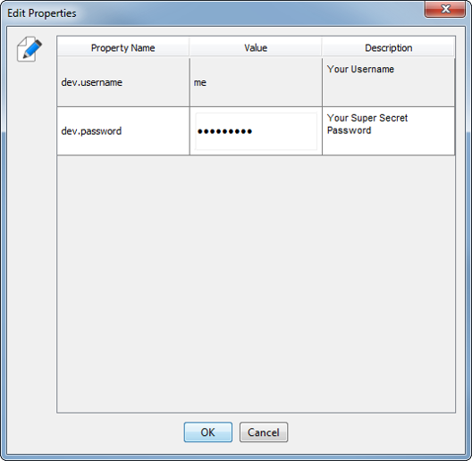

```text
      .:. Smart Properties .:.
       _______________________
      /   //=================/`"-._
     |   ||=================|      D
 jgs  \___\\_________________\__.-"
 ...::::::::::::::::::::::::::::.......
```

# Smart Properties

Do you want to access variable (and potentially sensitive) data while running development tasks, but don't want to commit the data to your team's project?

## Try Smart Properties.

Here is a simple demo:

> Recommended installation: copy [the single source code file](src/main/java/com/scarlatti/SmartProperties.java?raw=true) into your project.

```java
public class Demo {

    public static void main(String[] args) {
        Properties props = SmartProperties.get()
            .property("dev.username", "Your Username")
            .secretProperty("dev.password", "Your Super Secret Password")
            .fromFile(Paths.get("build/dev.properties"));  // or wherever you want to put the data

        System.out.println("Username is " + props.getProperty("dev.username"));
        System.out.println("Password is " + props.getProperty("dev.password"));
    }
}
```

You will be prompted to fill in your data the first time.
Your data will be persisted in Java properties format in the file you choose, and secret data will be obfuscated with Base64 encoding.
It will look something like this:



**`dev.properties`**
```
#Generated with SmartProperties.  Delete or edit this file to reset.
#Tue Oct 09 18:40:41 CDT 2018
dev.password=ZG9uJ3RlY2hvcGFzc3dvcmRzZXZlcg\=\=
dev.username=me
```

The output of running `Demo` will be something like this:

```text

> java.exe Demo.class...

      .:. Smart Properties .:.
      _______________________
     /   //=================/`"-._
    |   ||=================|      D
jgs  \___\\_________________\__.-"
...::::::::::::::::::::::::::::.......

Reading properties from file C:\Users\pc\project\build\dev.properties (delete this file to reset)
Missing some properties.  Look for a dialog.
Loaded SmartProperties from file C:\Users\pc\project\build\dev.properties
Username is me
Password is don'techopasswordsever
```

The next time you run the program `SmartProperties` will automatically load your data for you.

```
      .:. Smart Properties .:.
      _______________________
     /   //=================/`"-._
    |   ||=================|      D
jgs  \___\\_________________\__.-"
...::::::::::::::::::::::::::::.......

Reading properties from file C:\Users\pc\project\build\dev.properties (delete this file to reset)
Loaded SmartProperties from file C:\Users\pc\project\build\dev.properties
Username is me
Password is don'techopasswordsever
```

## Install
Smart Properties is small (40KB) and has no dependencies.  It requires Java JRE 8+;  Recommended installation is to copy [the single source code file](src/main/java/com/scarlatti/SmartProperties.java?raw=true) directly into your project.

## Advanced

`SmartProperties#get()` returns a `SmartProperties` object, which is an instance of `java.util.Properties`, so it can be used just like you would any other `Properties` object.

Some global properties can be configured via Java System Properties; these will override any otherwise configured values.

| Java System Property Name                    | Value Type          | Default | Effect |
|----------------------------------------------|---------------------|---------|--------|
| smartProperties.displayBanner                | boolean             | true    | Do or don't display the banner when reading properties.
| smartProperties.promptForMissingProperties   | boolean             | true    | Do or don't open the "Edit Properties" dialog when required properties are missing.
| smartProperties.timeoutMs                    | long (milliseconds) | 60000   | Automatically close the dialog box after waiting this many milleseconds.
| smartProperties.setLookAndFeel               | boolean             | true    | When true configures JavaSwing to use System Look And Feel.

Banner based on artwork by [Joan Stark](https://asciiart.website/joan/www.geocities.com/SoHo/7373/indexjava.html).